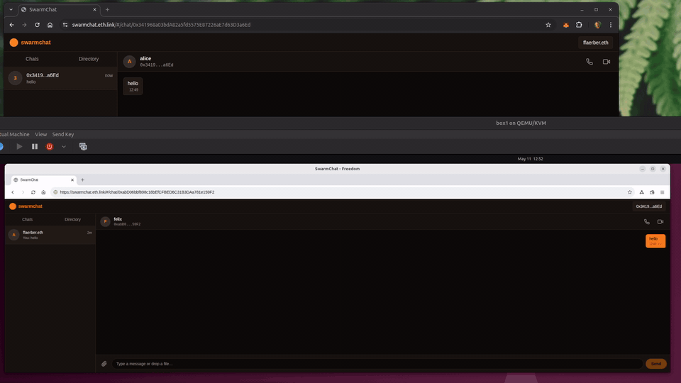

# SwarmChat

A decentralized 1:1 messenger and WebRTC video-calling dApp on Gnosis Chain + Ethereum Swarm.

Identity is your Ethereum wallet. Discovery is a public on-chain registry (`ContactRegistry`) on Gnosis Chain. Messages are signed, encrypted, and transported over Swarm PSS, with Swarm feeds acting as a per-user outbox for offline delivery. Designed to run inside [Freedom Browser](https://freedombrowser.eth.limo/), which ships with a local Bee node.

See [`swarmchat-spec.md`](./swarmchat-spec.md) for the full protocol specification.



## Live

- **App:** `bzz://swarmchat.eth/` (in [Freedom Browser](https://freedombrowser.eth.limo/)) — or [swarmchat.eth.limo](https://swarmchat.eth.limo/) / [swarmchat.eth.link](https://swarmchat.eth.link/) via HTTPS gateway (read-only without a local Bee).
- **Contract:** [`0x4F0Cb55E78D2a24f9aF01e96bc80833Dbb912B82`](https://gnosis.blockscout.com/address/0x4f0cb55e78d2a24f9af01e96bc80833dbb912b82) on Gnosis Chain (verified).

## Architecture

- **Smart Contract**: Solidity 0.8.28, built with Foundry
- **Frontend**: React 19 + TypeScript + Vite SPA (hash router for Swarm hosting)
- **Chain**: Gnosis Chain (xDAI for gas)
- **Storage**: Ethereum Swarm (PSS for real-time transport, feeds for store-and-forward)
- **Transport**: PSS via local Bee node at `http://127.0.0.1:1633`
- **ENS**: `swarmchat.eth`

## How It Works

| Action | Wallet | Bee node |
|---|---|---|
| Browse directory | No | No |
| Register profile | Yes + xDAI | Yes (PSS pubkey + overlay) |
| Send message | Yes | Yes + postage stamp |
| Receive message | Yes | Yes (full node, not gateway) |
| Video call | Yes | Yes (signaling) |

- **Identity** — your wallet address. Optionally an ENS name.
- **Discovery** — `ContactRegistry.register()` stores your display name, PSS public key, and Swarm overlay on-chain.
- **Messages** — JSON envelope, signed with your wallet, encrypted to the recipient's PSS public key, sent over PSS.
- **Offline delivery** — each sent message is also written to a per-recipient Swarm feed; recipients pull missed messages on startup.
- **Reliability** — Meshtastic-inspired: explicit ack, exponential-backoff retry (30s → 6h, 5 retries), 10k-entry msgId dedup cache.
- **Blocklist** — local-only (IndexedDB) in v1.
- **Video** — WebRTC signaling over PSS; media flows peer-to-peer once ICE is up. TURN fallback is the single centralized dependency.

## Messaging Stack

The frontend's `src/lib/` is a layered messaging library, each layer testable in isolation:

```
┌─────────────────────────────────────────────────────────┐
│ MessengerContext  (wires everything to React + wallet)  │
├─────────────────────────────────────────────────────────┤
│ Reliability       outbox, retry, ack, dedup             │
│ Feeds             store-and-forward via Swarm feeds     │
├─────────────────────────────────────────────────────────┤
│ Transport         envelope sign/verify, PSS send/sub    │
├─────────────────────────────────────────────────────────┤
│ envelope.ts       canonical JSON, EIP-191 sig, msgId    │
│ feed-key.ts       deterministic feed identity from wallet
└─────────────────────────────────────────────────────────┘
```

| File | Responsibility |
|---|---|
| `lib/envelope.ts` | Canonical-JSON encoding, `signEnvelope` (EIP-191), `verifyEnvelope` (recover sender), `makeMsgId(from‖nonce‖ts)`, `inboxTopic(wallet)` |
| `lib/transport.ts` | `Transport` wraps bee-js `pssSend` / `pssSubscribe`. Sig verification, blocklist filter, dedup cache. `retransmit()` reuses the original signed envelope so retries keep the same `msgId`. |
| `lib/outbox.ts` + `lib/idb-outbox.ts` | `OutboxStore` interface; in-memory and IndexedDB implementations |
| `lib/reliability.ts` | `Reliability` class — sends, schedules retries on the spec backoff, transitions on ack/read, fails after the budget |
| `lib/feeds.ts` | `Feeds.writeOutbox(recipient, env)` and `Feeds.readOutbox({ senderFeedOwner, sinceTs, maxItems })` |
| `lib/feed-key.ts` | `deriveFeedKey(signMessage)` — deterministic feed key from a one-time wallet signature over `swarmchat:feed-key:v1` |
| `lib/messages-store.ts` + `lib/idb-messages.ts` | UI-facing message store, indexed by peer; subscribable |
| `contexts/MessengerContext.tsx` | Builds the whole stack once wallet + bee + stamp + feed identity are ready |

## Contracts

| Contract | Address |
|---|---|
| ContactRegistry | `0x...` (set after deploy) |

## Prerequisites

- [Foundry](https://getfoundry.sh/) (`curl -L https://foundry.paradigm.xyz | bash && foundryup`)
- Node.js 20+
- A Bee node (bundled with [Freedom Browser](https://freedombrowser.eth.limo/), or stand-alone Bee)
- MetaMask or injected wallet

## Quick Start

```bash
# Install all dependencies (forge install + npm install)
make install

# Run the contract suite (unit + fuzz + invariants)
make test

# Run the frontend suite (unit + integration against in-memory mock-bee)
make test-frontend

# Run both
make test-all
```

### Local Development

```bash
# Terminal 1: start Anvil fork of Gnosis Chain
make anvil

# Terminal 2: fund wallets + deploy contract
make anvil-init

# Terminal 3: start frontend dev server
make dev
```

For a true two-user end-to-end test you need two real Bee nodes that can route PSS to each other (the `bee dev` mode is isolated and won't peer). Two practical options:

- **Local cluster**: [`fdp-play`](https://github.com/fairDataSociety/fdp-play) spins up a multi-node Swarm cluster + dev blockchain that auto-issues postage stamps. Closest to "real" without leaving your machine.
- **Sepolia testnet**: two real Bee full nodes joined to the testnet, funded via the [Ethswarm faucet](https://faucet.ethswarm.org/). Set `BEE_API_URL` per browser tab and point each at a different node.

## Testing

The repo has two parallel suites; both run on every `make test-all`.

### Solidity (Foundry)

```bash
make test          # forge test -vvv
make test-fork     # against a Gnosis Chain fork
make test-gas      # gas report
make coverage      # forge coverage
```

Covers:
- `test/ContactRegistry.t.sol` — happy paths, boundary cases, events, deactivate/reactivate, pagination edges
- `test/ContactRegistry.fuzz.t.sol` — fuzz tests for input validation and pagination bounds
- `test/ContactRegistry.invariant.t.sol` — handler-driven invariants (user count matches distinct registrants, no duplicate users, pagination stays in bounds)

### Frontend (Vitest)

```bash
make test-frontend       # vitest run
make test-frontend-watch # vitest watch
```

Covers:
- **Unit**: envelope sign/verify, canonical JSON, msgId determinism, outbox CRUD (in-memory and IndexedDB share a scenario suite via `fake-indexeddb`), reliability state machine with fake timers, feeds read/write, feed-key derivation
- **Integration**: a full `mock-bee` broker (Express + ws) simulates two PSS-routing Bee nodes in-process, so tests exercise bee-js → Transport → Reliability end-to-end without docker

The mock broker (`frontend/test/mock-bee/`) implements `/health`, `/addresses`, `/topology`, `/stamps`, `POST /pss/send/:topic/:target`, and WebSocket `/pss/subscribe/:topic`, with overlay-prefix routing — same semantics as a real Bee.

## Deploy

### Contract

```bash
make deploy-contract-chiado     # Deploy to Chiado testnet (chain 10200)
make deploy-contract            # Deploy to Gnosis Chain mainnet (chain 100)
make verify-contract CONTRACT=0x...
```

### Frontend

```bash
make deploy-frontend            # Build + upload to Swarm + update ENS
```

This builds the frontend, uploads to Swarm, and updates the ENS content hash on mainnet.

Target:
- https://swarmchat.eth.limo
- https://swarmchat.eth.bzz.link

### ENS Only

```bash
make update-ens SWARM_HASH=<hash>
```

### Full Deploy

```bash
make deploy-all                 # Contract + frontend
```

## All Make Commands

```
make help                       # Show all commands

# Setup
make install                    # Install contracts + frontend deps

# Development
make anvil                      # Start local Anvil fork of Gnosis Chain
make anvil-init                 # Fund wallets + deploy contract to local Anvil
make dev                        # Start frontend dev server

# Testing
make test                       # Run Solidity tests
make test-fork                  # Run Solidity tests against a Gnosis Chain fork
make test-unit                  # Solidity unit tests only (no fork)
make test-gas                   # Solidity tests with gas report
make coverage                   # Solidity coverage
make test-frontend              # Frontend tests (vitest)
make test-frontend-watch        # Frontend tests in watch mode
make test-all                   # Solidity + frontend

# Build
make build                      # Build contracts
make build-frontend             # Build frontend for production
make build-all                  # Build contracts + frontend
make abi                        # Extract ABI to frontend
make typecheck                  # Type-check frontend

# Deploy
make deploy-contract            # Deploy contract to Gnosis Chain
make deploy-contract-chiado     # Deploy contract to Chiado testnet
make deploy-contract-local      # Deploy contract to local Anvil
make deploy-frontend            # Build + upload to Swarm + update ENS
make update-ens                 # Update ENS content hash (SWARM_HASH=...)
make deploy-all                 # Contract + frontend to production
make verify-contract            # Verify on Blockscout (CONTRACT=0x...)

# Utilities
make clean                      # Remove build artifacts
make fmt                        # Format Solidity code
make snapshot                   # Create gas snapshot
```

## Project Structure

```
swarmchat/
├── src/
│   └── ContactRegistry.sol               # On-chain user directory
├── test/
│   ├── ContactRegistry.t.sol             # Unit tests
│   ├── ContactRegistry.fuzz.t.sol        # Fuzz tests
│   └── ContactRegistry.invariant.t.sol   # Handler-driven invariants
├── script/
│   └── Deploy.s.sol                      # Foundry deploy script
├── frontend/
│   ├── src/
│   │   ├── lib/                          # Messaging stack (see table above)
│   │   │   ├── envelope.ts
│   │   │   ├── transport.ts
│   │   │   ├── reliability.ts
│   │   │   ├── outbox.ts / idb-outbox.ts
│   │   │   ├── feeds.ts
│   │   │   ├── feed-key.ts
│   │   │   ├── messages-store.ts / idb-messages.ts
│   │   │   └── types.ts
│   │   ├── contexts/
│   │   │   └── MessengerContext.tsx      # Wires the stack to wallet + bee
│   │   ├── hooks/                        # useBee, BeeContext, useConversation, useConversations
│   │   ├── components/                   # Nav, Sidebar, ChatList, Conversation,
│   │   │                                 # Directory, Modal, ChainGuard, EnsName
│   │   ├── config/                       # wagmi, contract addresses + ABIs
│   │   └── abi/                          # ContactRegistry ABI
│   ├── test/
│   │   ├── unit/                         # envelope, outbox (shared), idb-outbox,
│   │   │                                 # reliability, reliability-feeds,
│   │   │                                 # feeds, feed-key
│   │   ├── integration/                  # transport, reliability, mock-bee messaging
│   │   └── mock-bee/                     # In-process multi-node Bee simulator
│   ├── vitest.config.ts
│   └── index.html
├── anvil-init.sh                         # Fund wallets + deploy to local fork
├── Makefile                              # Dev, test, build, deploy commands
├── foundry.toml                          # Foundry config
└── swarmchat-spec.md                     # Protocol specification
```

## Tech Stack

| Layer | Technology |
|---|---|
| Smart Contracts | Solidity 0.8.28, Foundry |
| Frontend | React 19, TypeScript, Vite, Tailwind CSS 4 |
| Web3 | wagmi v2, viem |
| Swarm SDK | @ethersphere/bee-js v11 |
| Routing | React Router 7 (hash router) |
| Storage (UI) | IndexedDB (`fake-indexeddb` for Node tests) |
| Test framework | Foundry (Solidity), Vitest (TS) |
| Chain | Gnosis Chain (ID: 100) |
| Storage | Ethereum Swarm (PSS + feeds) |
| Video | Native WebRTC |
| Hosting | Swarm + ENS |
